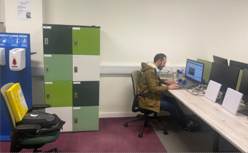

# Gen2 UHF RFID Reader
This is a Gen2 UHF RFID Reader. It is able to identify commercial Gen2 RFID Tags with FM0 line coding and 40kHz-160KHz data rate (BLF), and extract their EPC. It requires USRPN200 and a RFX900.  

The reader borrows elements from the software developed by Buettner, i.e. Data flow: Gate -> Decoder -> Reader as well as the conception regarding the detection of the reader commands. CRC calculation and checking functions were also adapted from https://www.cgran.org/browser/projects/gen2_rfid/.

### Implemented GNU Radio Blocks:

- Gate : Responsible for reader command detection.  
- Tag decoder : Responsible for frame synchronization, channel estimation, symbol period estimation and detection.  
- Reader : Create/send reader commands.

## Installation

- install log4cpp (http://log4cpp.sourceforge.net/)
- install UHD driver + GNU Radio using **wget http://www.sbrac.org/files/build-gnuradio && chmod a+x ./build-gnuradio && ./build-gnuradio**
- cd Gen2-UHF-RFID-Reader/gr-rfid/  
- mkdir build  
- cd build/  
- cmake ../ (logging should be enabled)  
- sudo make install  
- sudo ldconfig  

## Configuration

- Set USRPN200 address in apps/reader.py or readerV1.py (default: 192.168.10.2)
- Set frequency in apps/reader.py (default: 865MHz)
- Set tx amplitude in apps/reader.py (default: 0.1)
- Set rx gain in apps/reader.py (default: 20)
- Set maximum number of queries in include/global_vars.h (default:1000)
- **To decode multiple tags**, change const int FIXED_Q so that you increase the number of slots per inventory round.
  (In global_vars.h: const int FIXED_Q = 0;) start from 0 to 15

## How to run

- Real time execution:  
If you use an SBX daughterboard uncomment  #self.source.set_auto_dc_offset(False) in reader.py file
cd Gen2-UHF-RFID-Reader/gr-rfid/apps/    
sudo GR_SCHEDULER=STS nice -n -20 python ./reader.py     
After termination, part of EPC message (EPC[104:111]) of identified Tags is printed.  

- Offline:  
    Change DEBUG variable in apps/reader.py to TRUE (A test file already exists named file_source_test).  
    The reader works with offline traces without using a USRP.  
    The output after running the software with test file is:  
    
    | Number of queries/queryreps sent : 500  
    | Current Inventory round : 251  

    | Correctly decoded EPC : 45  
    | Number of unique tags : 6  
    | Tag ID Hex: 7a Num of reads : 14
    | Tag ID Hex: 7b Num of reads : 11
    | Tag ID Hex: 9c Num of reads : 64
    | Tag ID Hex: cf Num of reads : 4
    | Tag ID Hex: d6 Num of reads : 7
    | Tag ID Hex: e5 Num of reads : 3  
 
## Logging

- Configuration file : /home/username/.gnuradio/config.conf  
    Edit the above file and add the following lines  

    [LOG]  
    debug_file = /PathToLogFile/Filename  
    debug_level = info  
    
    Logging may cause latency issues if it is enabled during real time execution!

## Debugging  

The reader may fail to decode a tag response for the following reasons

1) Latency: For real time execution you should disable the output on the terminal. If you see debug messages, you should either install log4cpp or comment the corresponding lines in the source code e.g., GR_LOG_INFO(d_debug_logger, "EPC FAIL TO DECODE");

2) Antenna placement. Place the antennas side by side with a distance of 130cm between them and the tag 1m to 4.5m (it can detect a tag up to 6.2m) away facing the antennas.

3) Parameter tuning. The most important is self.ampl which controls the power of the transmitted signal (takes values between 0 and 1 but tested on 0.8).

If the reader still fails to decode tag responses, uncomment the following line in reader.py file

 #self.connect(self.source, self.file_sink_source)

Run the software for a few seconds (~5s). A file will be created in misc/data directory named source. This file contains the received samples. You can plot the amplitude of the received samples using the script located in misc/code folder. The figure should be similar to the .eps figure included in the folder. Plotting the figure can give some indication regarding the problem. You can also plot the output of any block by uncommenting the corresponding line in the reader.py file. Output files will be created in misc/data folder:

- /misc/data/source  
- /misc/data/matched_filter  
- /misc/data/gate 
- /misc/data/decoder  
- /misc/data/reader
    
## Hardware:

  - 1x USRPN200/N210  
  - 1x Ethernet cable  
  - 2x circular polarized antennas  (Slimline A5010)

## Tested on:
  Ubuntu 16.04 64-bit  
  GNU Radio 3.7.4
  
## If you use this software please cite the inspired work:
N. Kargas, F. Mavromatis and A. Bletsas, "Fully-Coherent Reader with Commodity SDR for Gen2 FM0 and Computational RFID", IEEE Wireless Communications Letters (WCL), Vol. 4, No. 6, pp. 617-620, Dec. 2015. 

